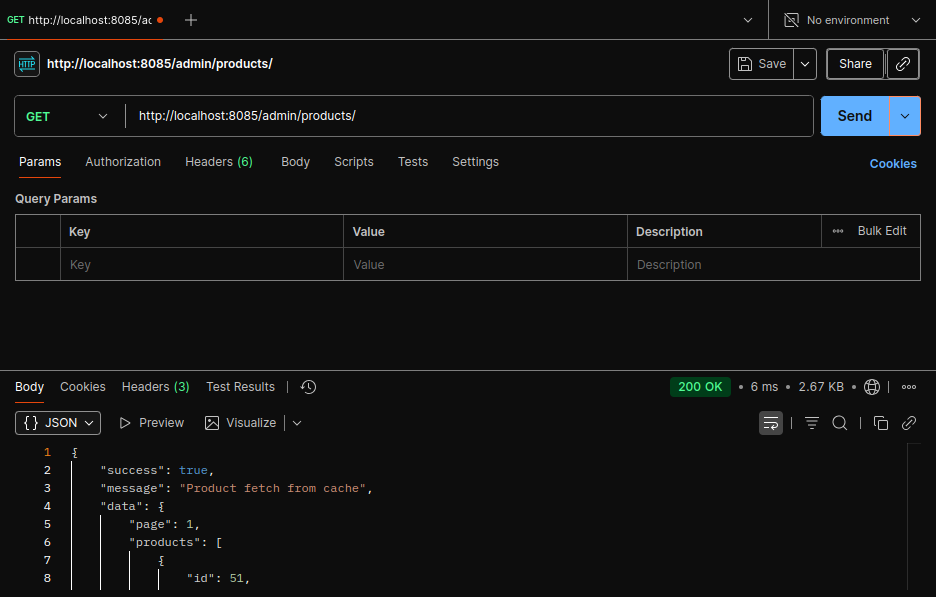

# Go E-Commerce Admin API

API ini adalah backend untuk aplikasi e-commerce, dibangun menggunakan Go (Gin) dan PostgreSQL. Mendukung manajemen produk, user, order, dan lainnya dengan fitur CRUD, pagination, dan search.

## API ENDPOINT
### User Admin
Method	Endpoint	Deskripsi
GET	/admin/userslist	List user dengan pagination dan search
POST	/admin/userslist	Tambah user baru
PATCH	/admin/userslist/:id	Edit user

### Product Admin
Method	Endpoint	Deskripsi
POST	/admin/products	Tambah produk
GET	/admin/products	List produk (pagination & search)
PATCH	/admin/products/:id	Edit produk
DELETE	/admin/products/:id	Hapus produk

### Order Admin
Method	Endpoint	Deskripsi
GET	/admin/orders	List orders
PATCH	/admin/orders/:id/status	Update status order
DELETE	/admin/orders/:id	Hapus order

### Preview waktu sebelum caching
Waktu 33 ms

### Preview waktu sesudah caching
Waktu 6 ms

