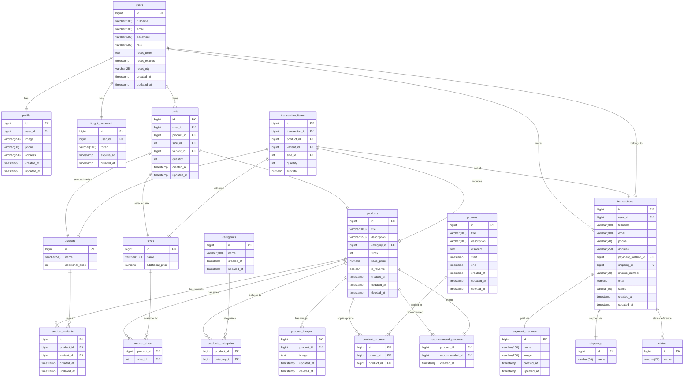

# Go E-Commerce Admin API

API ini adalah backend untuk aplikasi e-commerce, dibangun menggunakan Go (Gin) dan PostgreSQL. Mendukung manajemen produk, user, order, dan lainnya dengan fitur CRUD, pagination, dan search.

## Preview ERD

## API ENDPOINT

### Admin
Method	Endpoint	        Deskripsi
- GET	/admin/users	    List user dengan pagination dan search
- GET /admin/users/:id      Dapatkan user berdasrkan id
- POST	/admin/users	    Tambah user baru
- PATCH	/admin/users/:id	Edit user
- DELETE /admin/users/:id   Delete user

### Product Admin
Method	Endpoint	                            Deskripsi
- POST	/admin/products	                        Tambah produk
- GET	/admin/products	                        List produk (pagination & search)
- GETH	/admin/products/:id	                    produk by id
- DELETE	/admin/products/:id	                Hapus produk
- PATCH /admin/products/:id                     Edit product
- GET /products/:id/images                      Image id product
- GET /products/:id/images/:image_id            Product id images id
- PATCH /products/:id/images/:image_id          Edit Product id images id
- DELETE GET /products/:id/images/:image_id     Delete Product id images id

### Order Admin
Method	Endpoint	Deskripsi
- GET	/admin/orders	List orders
- PATCH	/admin/orders/:id/status	Update status order
- DELETE	/admin/orders/:id	Hapus order

### Preview waktu sebelum caching
Waktu 33 ms

### Preview waktu sesudah caching
Waktu 6 ms

